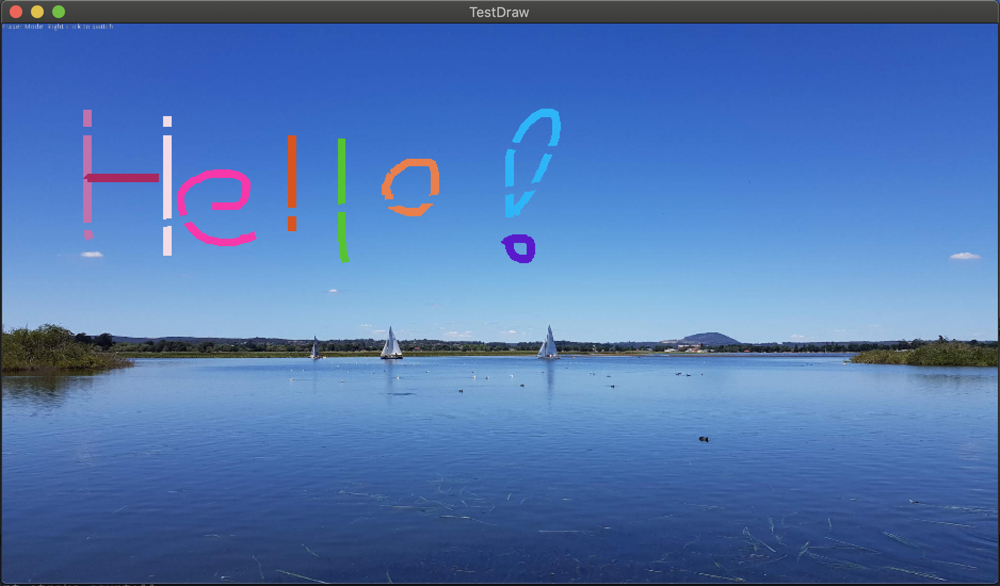

# What

This is a simple demo godot project to implement draw/eraser/undo tool on top of a background image (TextureRect), where you can erase pixels without affecting the background TextureRect.

# Why

When I try to implement draw tool using Line2D objects, it is not very obvious how to implement eraser tool to clear part of the pixels drawn. Simply setting another Line2D with color alpha = 0 doesn't work. See [discussion of this godot issue](https://github.com/godotengine/godot/issues/10255). 

This project uses a Viewport to achieve the goal so we can easily implement draw/eraser tool.

The undo functionality is just as easy as deleting the last created Line2D object.

# Usage

There are 3 modes, draw/eraser/undo. Switch mode by _right clicking_ on the whole canvas.

- draw: default mode. Hold left button and drag to draw as usual. Color is random.
- eraser: same as draw, hold left button and drag to erase as you want.
- undo: left click to undo the last stroke. 

